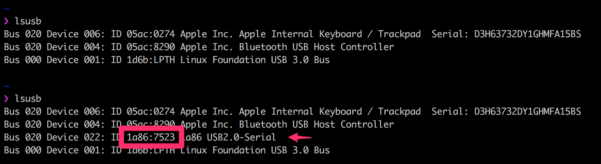

# RoboticaJS
Desarrollaremos los conceptos básicos de robótica y domótica utilizando tecnologías conocidas y componentes de muy bajo presupuesto y al alcance de todos.

Utilizaremos JavaScript como lenguaje base de progarmación para los dispositivos.

_Author [Marcos Tomatti](mailto:mtomatti@elementum.com)_

### Prerequisitos

- [Git](https://git-scm.com)
- [Node.js and npm](nodejs.org) Node ^6.9.11 **IMPORTANTE**

### Instalación

1. Para instalar las dependencias del proyecto ejecutar:
   
   `$ npm install`
   
2. Según los diferentes sistemas operativos, podríamos encontrarnos con alguno de los siguientes problemas comunes:
    - Linux, sin permisos para leer/ecribir el puerto USB:
        - `$ sudo usermod -a -G dialout <username>`
        - `$ sudo chmod a+rw /dev/ttyACM0`

        Where &lt;username&gt; is your login  user name in linux, /dev/ttyACM0 is the detected device of your Arduino board, the name may actually change depending on the board.

    - Windows, es recomendable correr la consola como administrador.
    - Mac OSX, suele no reconocer los USB de los arduinos. Para idenitifcar el modelo y bajar los drivers hay que correr:
        - `$ brew update && brew tap jlhonora/lsusb && brew install lsusb`
        - Ejecutandp `$ lsusb` con y sin el arduino conectado podremos identificar que ID de fabricante y de dispositivo tiene el microcontrolador. Ese id nos permitirá buscar y encontrar el driver adecuado para nuestro dispositivo.
          
          

3. Si todo salió bien, ya podemos probar nuestro arduino con un simple "hola mundo":
    `$ npm start`

### Firmware
Cuando tenemos un arduino nuevo, o debemos usar una versión especial de firmata para conectar a nuestros dispositivos, deberemos _flashealo_.

En la sección de [firmwares](./firmwares) encontrarán detalles de como hacerlo.

### Kits
Para el workshop tenemos preparados algunos kits con diferentes desafíos:

### Ejemplos de Codigo
- [Botones](./examples/button)
- [Fotoresistencia](./examples/photoresistor)
- [Higrómetro](./examples/hygrometer)
- [Leds](./examples/led)
- *[Leds RGB](./examples/rgb_led)
- [Leds de 2 colores](./examples/two_color_leds)
- *[Motores continuos](examples/dc_motors/)
- [Servomotores](./examples/servo_motors)
- *[Motores paso a paso](./examples/steppers)
- [Piezo / Sonido](./examples/piezo)
- [Sensores análgos y digitales](./examples/sensors)
- [Sensor de movimiento](./examples/movement)
- [Potenciómetro](./examples/potentiometer)
- [Termistor](./examples/thermistor)
- [Termómetro](./examples/temperature)

Otros ejemplos:
- [Backpack  I2C](./examples/i2c_backpack)
- [Keypress](./examples/keypress)
- [REPL](./examples/repl)

## License
Licensed under the MIT license.
