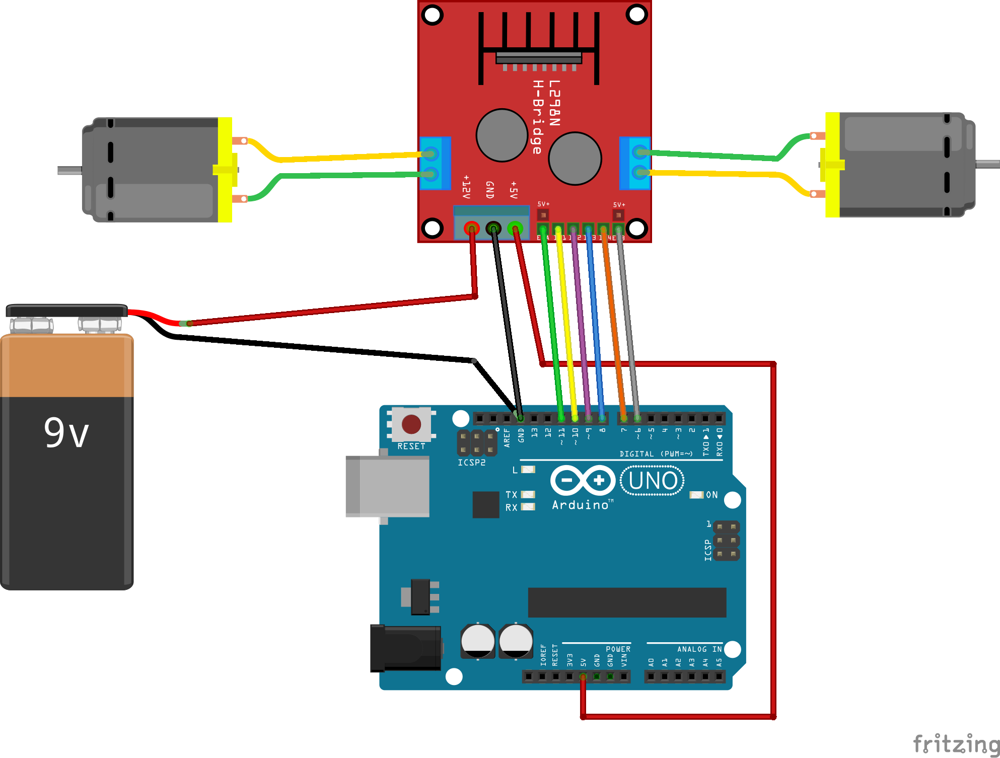

## Ejemplo Motores Continuos

### Cableado


### Código
```javascript
const five = require('johnny-five');

const board = new five.Board();

board.on('ready', function onReady() {
  const motorA = new five.Motor({
      pins: {
        pwm: 6,
        dir: 7,
        cdir: 8
      }
    }),
    motorB = new five.Motor({
      pins: {
        pwm: 11,
        dir: 10,
        cdir: 9
      }
    });

  // 100% velocidad al frente en los dos motores
  motorA.forward(255);
  motorB.forward(255);

  setTimeout(() => {
    // 100% velocidad marcha atras en los dos motores
    motorA.reverse(255);
    motorB.reverse(255);
  }, 5000);

  setTimeout(() => {
    // freno total
    motorA.stop();
    motorB.stop();
  }, 10000);
});
```

### Referencia de la API
[motor](http://johnny-five.io/api/motor/)