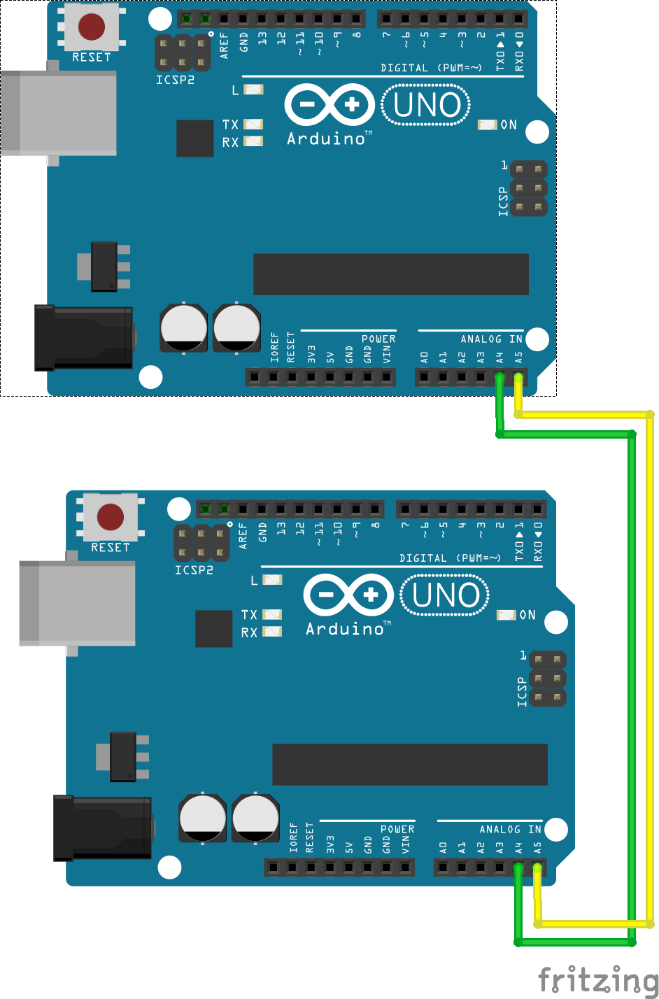

## Ejemplo Backpacking con I2C

### Cableado



### Código JS
```javascript
const five = require('johnny-five');

const board = new five.Board();

const int16 = function(msb, lsb) {
  const result = (msb << 8) | lsb;
  return result >> 15 ? ((result ^ 0xFFFF) + 1) * -1 : result;
};

board.on("ready", () => {
  board.i2cConfig();

  board.i2cRead(0x0A, 2, (bytes) => {
    console.log("data ", int16(bytes[0], bytes[1]));
  });
  
  const blink = () => {
    board.i2cWrite(0x0A, [0x01]);
  };

});
```

### Código Arduino
```c
#include <Wire.h>

// Address Pins
#define LED_PIN 13

// I2C Defaults
#define I2C_DEFAULT_ADDRESS 0x0A // esta es la direccion con la que identificamos cada dispositivo. 
#define I2C_BUFFER_SIZE 2 // tamaño del buffer de datos que vamos a enviar. 

byte buffer[I2C_BUFFER_SIZE];

int myAddress = I2C_DEFAULT_ADDRESS;
int data;

void setup()
{
  pinMode(LED_PIN, OUTPUT);
  Wire.begin (myAddress);
           
  
  Wire.onRequest(requestEvents);
  Wire.onReceive(receiveEvent);
}


void loop() {

  // Definimos el estado del led dentro de receiveEvent, aqui lo usamos
  digitalWrite(LED_PIN, LED_STATUS);
  
  
  // Seteamos el valor de DATA aca
  data = 10;
}

void requestEvents () {
  // Ponemos nuestro codigo aca, que va a formatear la DATA le pasamos al dispositivo MAESTRO. 
  buffer[0] = data >> 8;
  buffer[1] = data & 0xFF;

  Wire.write(buffer, I2C_BUFFER_SIZE);
}

void receiveEvent (int received)
{
  LED_STATUS = LOW;
  if(received > 0) {
    // Recibimos algo del MAESTRO, realizamos una accion acorde dentro de este bloque
    LED_STATUS = HIGH;
    
    // Si recibimos algo, tenemos que leer toda la data
    while(Wire.available()){
      Wire.read();
    }   
  }
}
```


### Referencia de la API
[Board](http://johnny-five.io/api/board)