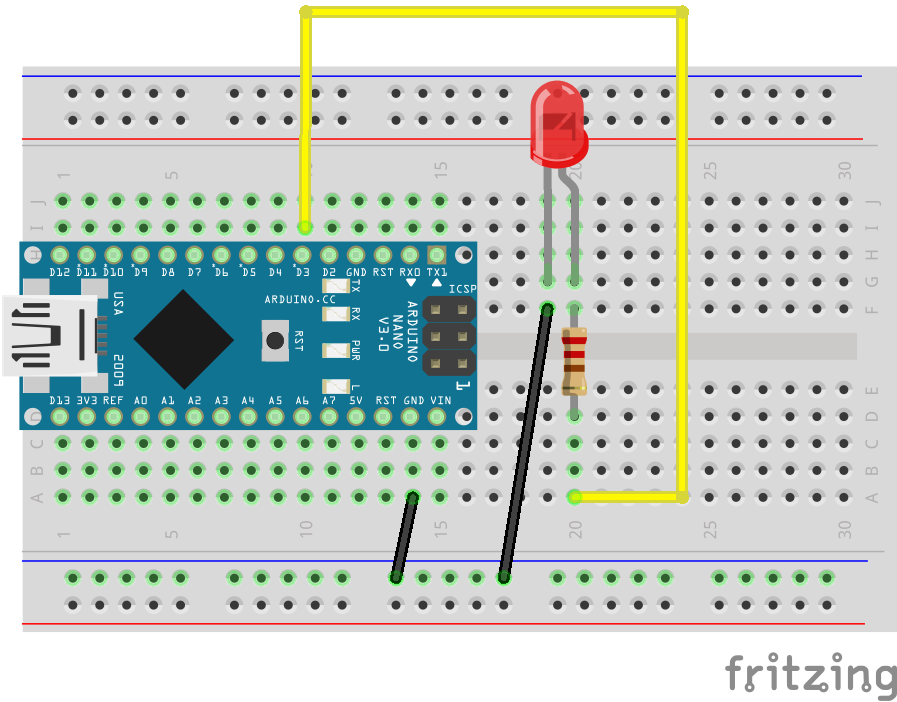

## Ejemplo LED

### Cableado


NOTA: Para el ejemplo inicial de "hola mundo" no se necesita cableado. La gran mayoria, si no todos, los Arduinos vienen con un led integrado en el pin D13.

### Código
```javascript
const five = require('johnny-five');

const board = new five.Board();

board.on('ready', () => {
  const led = new five.Led(13);
  led.strobe(500);
});

```

### Referencia de la API
[Leds](http://johnny-five.io/api/led)
