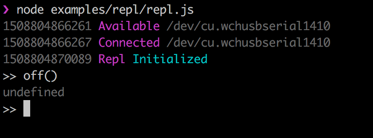

## Ejemplo REPL

### Que es?
Del Inglés **R**ead**E**valuate**P**rint**L**oop, esta funcionalidad nos provee de una consola interactiva para poder acceder a los atributos, objetos y/o funciones que nosotros querramos exponer en tiempo de ejecución. Es ideal para procesos de debug y configuración.

### Código
```javascript
const five = require('johnny-five');

const board = new five.Board();

board.on('ready', () => {
  const led = new five.Led(13);
  led.strobe(500);
  board.repl.inject({
    // Allow limited on/off control access to the
    // Led instance from the REPL.
    on: function() {
      led.on();
    },
    off: function() {
      led.off();
    }
  });
});

```

