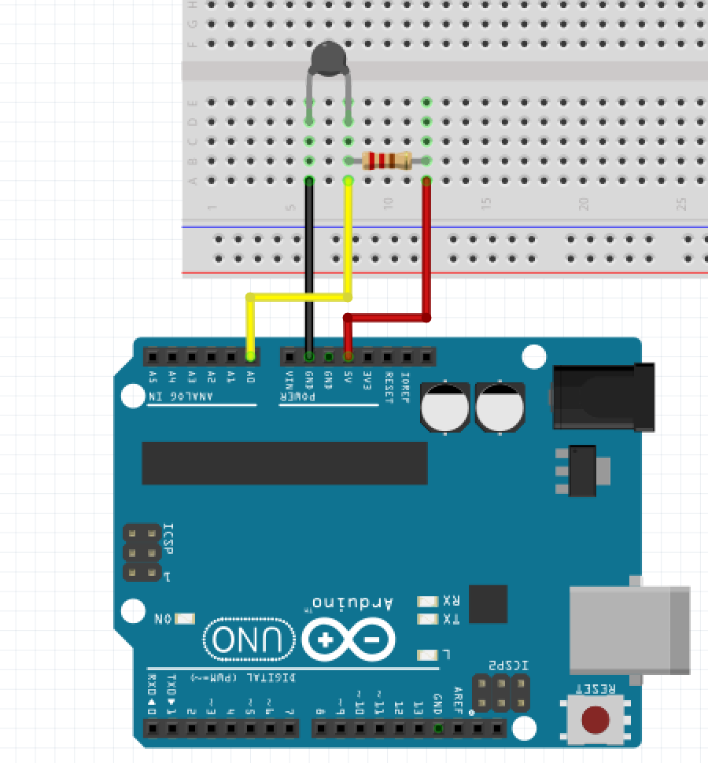

## Ejemplo Termistor

### Cableado

    
Nota: como lo explicado en los ejemplos de [sensores](../sensors), un termistor puede tener un cableado distinto o requerir de una resistencia adicional. 


### Código
```javascript
const five = require('johnny-five');

let board = new five.Board();

// Los termistores miden una resistencia especifica segun la temperatura, similar a como funcionan las fotoresistencias. Ese valor en ohms, deberemos convertilo a celcius o farenheit segun sea necesario. 
function voltToTemp(resistance) {
    let tempC;
    const thermistorOhm = 10000,
        nominalTemp = 25,
        betaCoef = 3435,  // este valor suele ser especifico para el sensor, usualmente relacionado con la marca o fabricante.
        resistorOhm = 10000;

    resistance = 1023 / resistance - 1;
    resistance = resistorOhm / resistance;
    console.log(`Resistance: ${resistance}`);


    tempC = resistance / thermistorOhm;                 // (R/Ro)
    tempC = parseFloat(Math.log(tempC).toFixed(2));     // ln(R/Ro)
    tempC /= betaCoef;                                  // 1/B * ln(R/Ro)
    tempC += 1 / (nominalTemp + 273.15);                // + (1/To)
    tempC = 1 / tempC;                                  // Invert
    tempC -= 273.15;                                    // convert to C

    console.log(`Temperature: ${parseFloat(tempC.toFixed(2))}`);
}

board.on('ready', () => {

    let thermistor = new five.Sensor({
            pin: 'A0',
            freq: 1000
        }),
        average = 0,
        count = 0;

    thermistor.on('data', (data) => {
        if (count < 5) {
            average += data;
            count++;
        } else {
            voltToTemp(average/5);
            count = 0;
            average = 0;
        }

    });

});
```

### Referencia de la API
[Sensor](http://johnny-five.io/api/sensor)