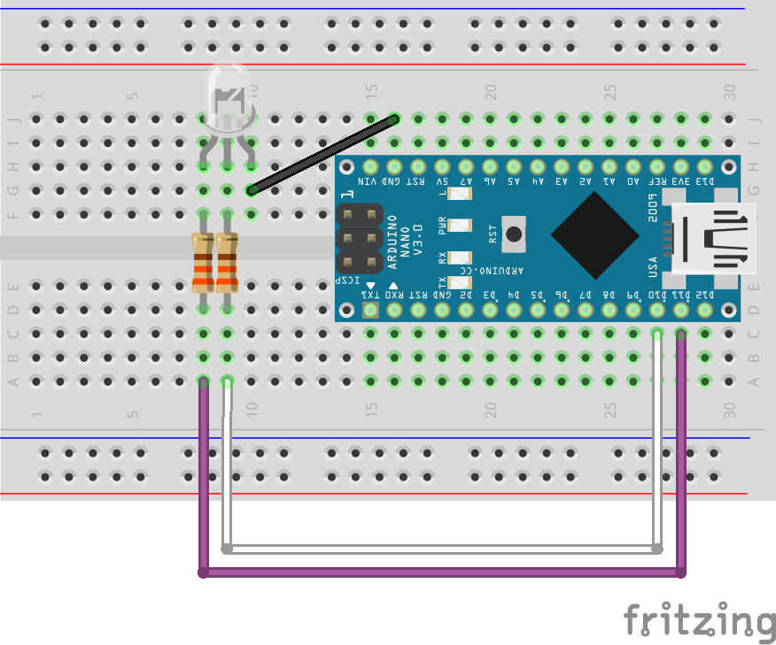

## Ejemplo LED de 2 colores

### Cableado

### Codigo
```javascript
const five = require('johnny-five');

let board = new five.Board();

board.on('ready', () => {

    let greenLed = new five.Led(10),
        redLed = new five.Led(11),
        direction = 1;
    greenLed.brightness(255);
    redLed.brightness(0);
    board.loop(5000, () => {

        if (direction > 0) {
            greenLed.fade(0, 4000);
            redLed.fade(255, 4000);
            direction = -1;
        } else {
            greenLed.fade(255, 4000);
            redLed.fade(0, 4000);
            direction = 1;
        }
    });
});
```

### Referencia de la API
[Leds](http://johnny-five.io/api/led)
